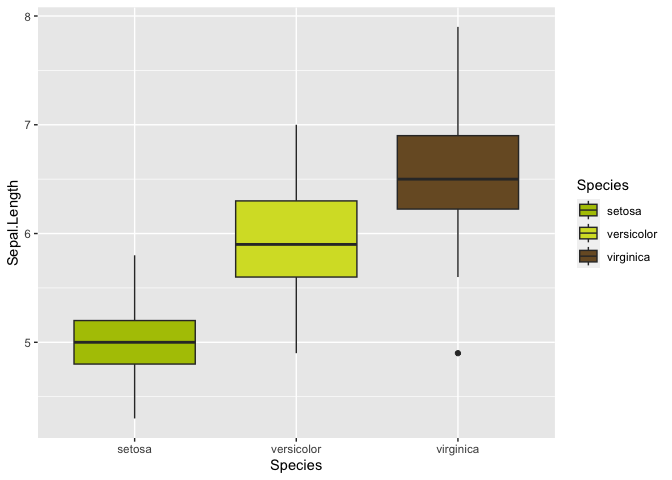
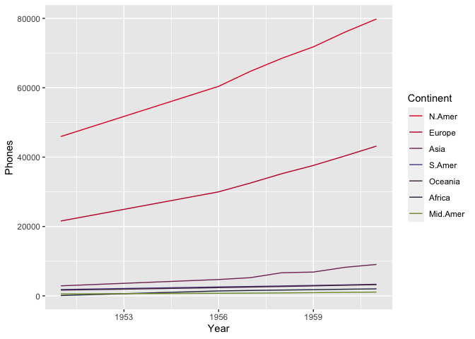

<!-- README.md is generated from README.Rmd. Please edit that file -->

# shRek

<!-- badges: start -->
<!-- badges: end -->

The goal of shRek is to …

## Installation

You can install the development version of shRek from
[GitHub](https://github.com/) with:

``` r
# install.packages("devtools")
devtools::install_github("lgaspardboulinc31/shRek")
```

## How to use

This is a basic example which shows you how to solve a common problem:

``` r
# burp allows to extract color palette from the ones available
shrek_color <- burp("Shrek", pal_class="Hero", n=6)

# show_my_swamp displays the palette in a nice way
show_my_swamp(shrek_color)
```


## Example with plot

In this section, we show diverse way to use the color palette to plot
with your data.

### Some classical example

``` r
# Pick colors
shrek_pal = burp("Shrek",pal_class="Hero",n=3)

#Do Plot
ggplot(iris, aes(y=Sepal.Length, x=Species, fill=Species)) + geom_boxplot() +
  scale_fill_manual(values=shrek_pal)
```



``` r
# Pick Fairy Godmother palette
pal= burp("Fairy_Godmother","Villain",n=5)
# Make plot
ggplot(data=diamonds, aes(x=price, group=cut, fill=cut)) +
    geom_density(adjust=1.5, alpha=0.7)  + scale_fill_manual(values=pal)
```


``` r
# Let pick Dragon_Keep palette
dragon <- c(burp("Dragon_Keep", pal_class = "Place", n=6),burp("Dragon", pal_class = "Hero", n=1))
#show_my_swamp(dragon)

library(reshape2)
WorldPhones.m = melt(WorldPhones)
colnames(WorldPhones.m) = c("Year", "Continent", "Phones")
head(WorldPhones.m)
#>   Year Continent Phones
#> 1 1951    N.Amer  45939
#> 2 1956    N.Amer  60423
#> 3 1957    N.Amer  64721
#> 4 1958    N.Amer  68484
#> 5 1959    N.Amer  71799
#> 6 1960    N.Amer  76036
# Make plot
ggplot(WorldPhones.m, aes(x=Year, y=Phones, color=Continent)) + geom_line() + scale_color_manual(values=dragon)
```


