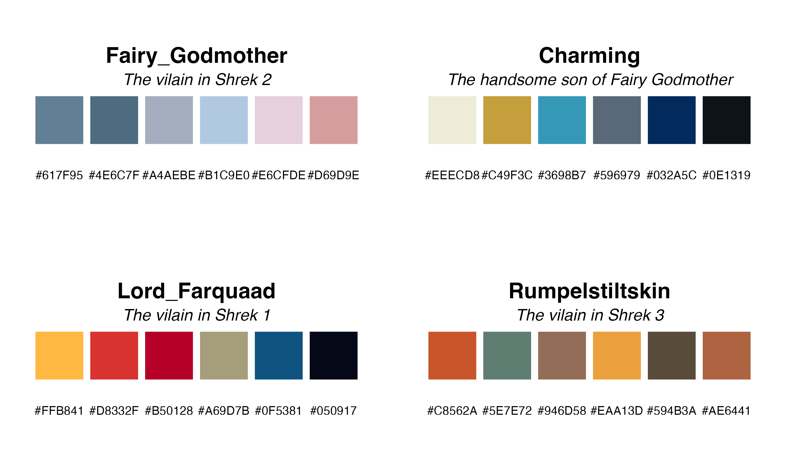
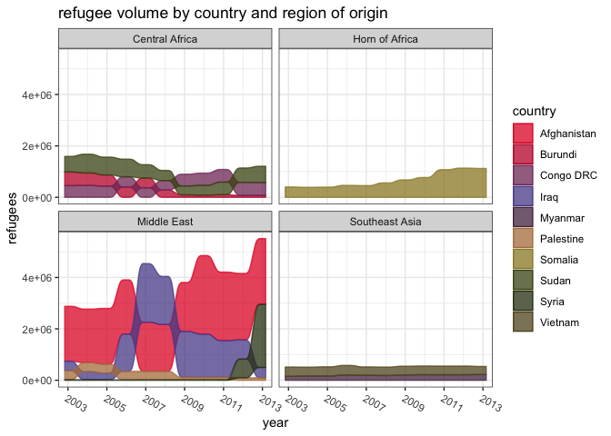
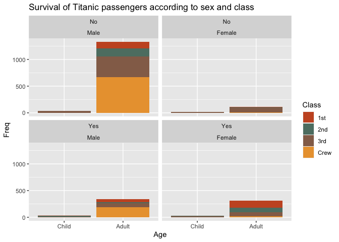

<!-- README.md is generated from README.Rmd. Please edit that file -->

# shRek

<!-- badges: start -->
<!-- badges: end -->

shRek is a R package inspired from the movie franchise Shrek and
adapated from William Steig picture book. No matter if you are an ugly
ogre that does not want to get out of your swamp, a funny donkey or a
Villain that has no courage to go save the princess, you are welcome to
use this package to embellish your plots or input some random quotes in
your code!

## Installation

 You can
install the development version of shRek from
[GitHub](https://github.com/) with:

``` r
# install.packages("devtools")
devtools::install_github("lgaspardboulinc31/shRek")
```

## How to use

This is an introduction to shRek, the available color palette and how to
use them.

### The available color palettes

``` r
# Retrieve the available palettes
hero_palettes
#> $Shrek
#> [1] "#B0C400" "#D5DE2E" "#795A2D" "#523213" "#C3BC95" "#D3CCA5"
#> 
#> $Fiona
#> [1] "#DEC33E" "#C0B037" "#A25E2E" "#5A5832" "#53432A" "#40473C"
#> 
#> $Puss_in_Boots
#> [1] "#F0B56E" "#F4983F" "#B58421" "#6E342C" "#624835" "#90837A"
#> 
#> $Dragon
#> [1] "#809737" "#CE603D" "#C25866" "#953644" "#A3534D" "#A80216"
#> 
#> $Gingy
#> [1] "#CD524F" "#C5812A" "#BCA7A0" "#6F748C" "#864590"
#> 
#> $Pinocchio
#> [1] "#E7B621" "#730000" "#007DAD" "#DCBB82" "#746225"
```

``` r
knitr::include_graphics("./images/all_colors_hero.png")
```


``` r
villain_palettes
#> $Fairy_Godmother
#> [1] "#617F95" "#4E6C7F" "#A4AEBE" "#B1C9E0" "#E6CFDE" "#D69D9E"
#> 
#> $Charming
#> [1] "#EEECD8" "#C49F3C" "#3698B7" "#596979" "#032A5C" "#0E1319"
#> 
#> $Lord_Farquaad
#> [1] "#FFB841" "#D8332F" "#B50128" "#A69D7B" "#0F5381" "#050917"
#> 
#> $Rumpelstiltskin
#> [1] "#C8562A" "#5E7E72" "#946D58" "#EAA13D" "#594B3A" "#AE6441"
```



``` r
place_palettes
#> $Duloc
#> [1] "#72767D" "#D2D0BD" "#AEB5C3" "#737F9D" "#262C44" "#181B17"
#> 
#> $Far_Far_Away
#> [1] "#929BD4" "#F2C27F" "#CE9671" "#893F31" "#AC9E54" "#373F0D"
#> 
#> $Dragon_Keep
#> [1] "#E31A2D" "#C20F33" "#813666" "#584B96" "#542F4D" "#2C304A"
#> 
#> $Swamp
#> [1] "#B27D4B" "#9A872C" "#465013" "#2F3A13" "#605324" "#222612"
```


### Classic example

``` r
# burp allows to extract color palette from the ones available
shrek_color <- burp("Shrek", pal_class="Hero", n=6)

# show_my_swamp displays the palette in a nice way
show_my_swamp(shrek_color)
```


### Example with plot

In this section, we show diverse way to use the color palette to plot
with your data.

#### Iris dataset example

``` r
# Pick colors
shrek_pal = burp("Shrek",pal_class="Hero",n=3)

#Do Plot
ggplot(iris, aes(y=Sepal.Length, x=Species, fill=Species)) + geom_boxplot() +
  scale_fill_manual(values=shrek_pal)
```


#### Diamonds dataset example

``` r
# Pick Fairy Godmother palette
pal= burp("Fairy_Godmother","Villain",n=5)
# Make plot
ggplot(data=diamonds, aes(x=price, group=cut, fill=cut)) +
    geom_density(adjust=1.5, alpha=0.7)  + scale_fill_manual(values=pal)
```


#### WorldPhones example

``` r
library(ggalluvial)
# Use dataset of Refugee
data(Refugees, package = "alluvial")
country_regions <- c(
  Afghanistan = "Middle East",
  Burundi = "Central Africa",
  `Congo DRC` = "Central Africa",
  Iraq = "Middle East",
  Myanmar = "Southeast Asia",
  Palestine = "Middle East",
  Somalia = "Horn of Africa",
  Sudan = "Central Africa",
  Syria = "Middle East",
  Vietnam = "Southeast Asia"
)
Refugees$region <- country_regions[Refugees$country]

## Pick color scale in palette
places_pal <- c(burp("Dragon_Keep", pal_class = "Places", n=5),
                burp("Swamp", pal_class = "Places", n=5))

ggplot(data = Refugees,
       aes(x = year, y = refugees, alluvium = country)) +
  geom_alluvium(aes(fill = country, colour = country),
                alpha = .75, decreasing = FALSE) +
  scale_x_continuous(breaks = seq(2003, 2013, 2)) +
  theme_bw() +
  theme(axis.text.x = element_text(angle = -30, hjust = 0)) +
  scale_fill_manual(values=places_pal) +
  scale_color_manual(values=places_pal) +
  facet_wrap(~ region, scales = "fixed") +
  ggtitle("refugee volume by country and region of origin")
```



#### Example with Titanic data

``` r
# Pick color
pal <-burp("Rumpelstiltskin",pal_class="Villain",n=4)

#Check survival
ggplot(data=as.data.frame(Titanic), aes(x=Age, y=Freq, fill=Class)) + geom_bar(stat="identity") + facet_wrap(~Survived+Sex)+
  scale_fill_manual(values=pal)+
  labs(title="Survival of Titanic passengers according to sex and class")
```


